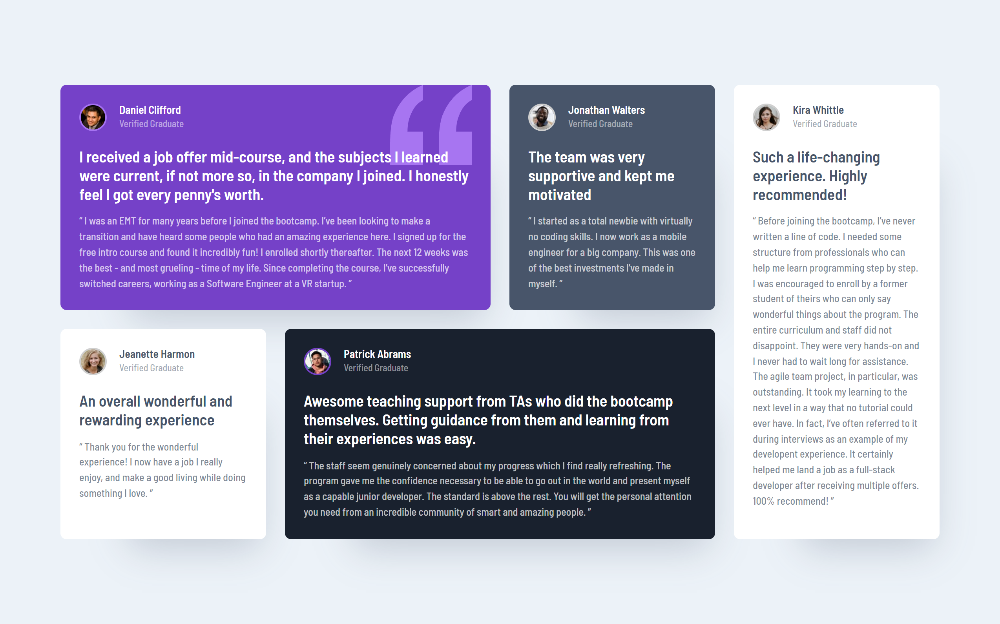

# Frontend Mentor - Testimonials grid section solution

This is a solution to the [Testimonials grid section challenge on Frontend Mentor](https://www.frontendmentor.io/challenges/testimonials-grid-section-Nnw6J7Un7). Frontend Mentor challenges help you improve your coding skills by building realistic projects. 

## Table of contents

- [Overview](#overview)
  - [The challenge](#the-challenge)
  - [Screenshot](#screenshot)
  - [Links](#links)
- [My process](#my-process)
  - [Built with](#built-with)
  - [What I learned](#what-i-learned)
- [Author](#author)

## Overview

### The challenge

Users should be able to:

- See hover and focus states for all interactive elements on the page

### Screenshot

### Links

- Solution URL: [https://github.com/ijohnst/fe-mentor-testimonials-grid](https://github.com/ijohnst/fe-mentor-testimonials-grid)
- Live Site URL: [https://ijohnst.github.io/fe-mentor-testimonials-grid/](https://ijohnst.github.io/fe-mentor-testimonials-grid/)

## My process

### Built with

- Semantic HTML5 markup
- CSS custom properties
- CSS Grid
- Mobile-first workflow

### What I learned

CSS Grid

## Author

- Website - [Professional Portfolio](https://ianjdigital.com)
- Frontend Mentor - [@ijohnst](https://www.frontendmentor.io/profile/ijohnst)
